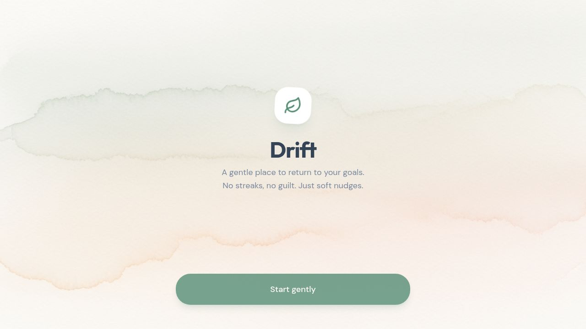
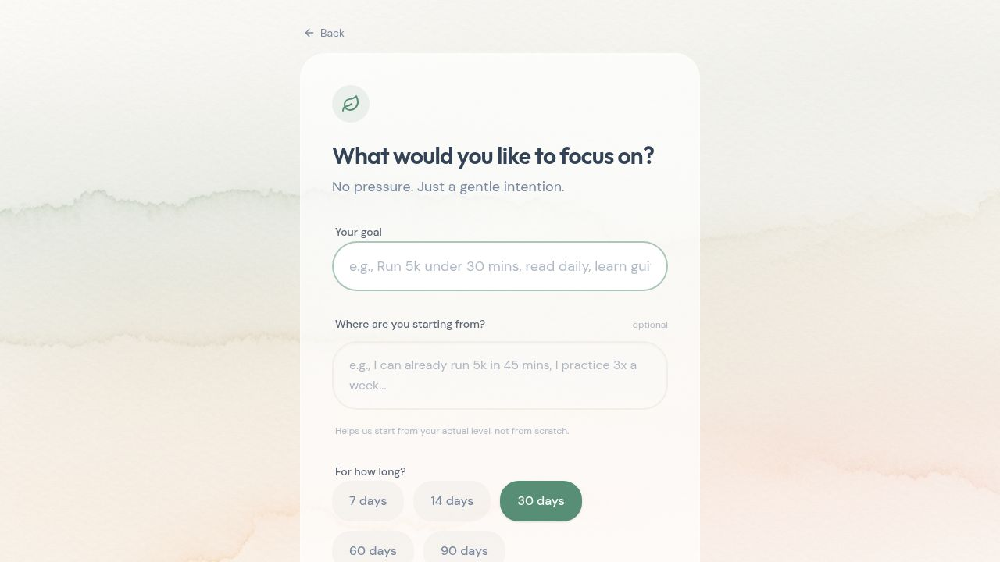

# Drift — App Overview

> A gentle place to return to your goals. No streaks, no guilt. Just soft nudges.

---

## What is Drift?

Drift is a mobile-first adaptive motivation assistant. Unlike traditional productivity apps that reward streaks and punish missed days, Drift is built around one idea: **it's okay to pause, and coming back is always possible.**

When users struggle or miss days, Drift doesn't penalize them — it quietly makes things easier and meets them where they are.

Access here: https://drift-ada--misalp.replit.app/
---

## Screenshots

### Landing Screen

### Setup Screen

---

## Pages & User Flows

### 1. Landing Page (`/`)

The first thing a user sees when they open the app.

**Empty state (no goals yet):**
- Animated leaf logo with a spring bounce-in effect
- Tagline: *"A gentle place to return to your goals. No streaks, no guilt. Just soft nudges."*
- Single CTA button: **"Start gently"**
- Save Progress Banner prompting sign-in (non-intrusive)

**With active goals:**
- Time-of-day greeting: *Good morning / Good afternoon / Good evening*
- Today's date displayed below the greeting
- Each goal shown as a **glass card** with:
  - Goal title
  - Animated progress bar (fills on load)
  - Current engagement state badge (color-coded dot + label)
  - Day counter: *"Day 3 of 30"*
  - Quick link to the Calendar view
- "Set a new intention" ghost button at the bottom

---

### 2. Setup Page (`/setup`)

Where users create a new goal (called an "intention").

- Question: *"What would you like to focus on?"*
- **Goal field** — free text input (e.g., *Run 5k under 30 mins, read daily, learn guitar*)
- **Starting context field** (optional) — helps the AI calibrate from the user's real level, not zero
  - Hint text: *"Helps us start from your actual level, not from scratch."*
- **Duration selector** — pill-style toggle buttons: 7 / 14 / 30 / 60 / 90 days
- On submit: transitions to a **"Thinking" loading state**
  - Pulsing glow behind a spinner
  - Message: *"Crafting a path that feels doable, not demanding."*
- Once the AI finishes, the user is taken directly to their first task

---

### 3. Daily Task Page (`/goal/:id`)

The core daily interaction screen. It has four sub-views that animate between each other.

#### Sub-view A: The Task
- State badge at the top (e.g., "On Track", "Drifting")
- **Adaptive message** — a short, kind message from the AI that changes based on engagement state
- Task card (glass card) showing:
  - Day number badge
  - Estimated time (in minutes)
  - Task title and description
- Three action buttons:
  - **Done for today** — primary green button
  - **This is too much** — ghost button, triggers the Mini Task flow
  - **Skip today** — ghost button

#### Sub-view B: Mini Task Offer
Triggered when the user taps "This is too much."
- Warm amber styling with sparkle icon
- Message: *"That's completely okay."*
- Offers a **Gentle version** of the task — just 5 minutes
- Two choices: *"Yes, I'll try this"* or *"Not even this today"*

#### Sub-view C: Doing the Mini Task
- Confirms the user is in "Gentle mode — 5 minutes"
- Reassuring message: *"Just start. You can stop after 5 minutes."*
- Same task shown with low-pressure framing
- Two choices: *"Done — I showed up"* or *"Still too much today"*

#### Sub-view D: Feedback Screen
Shown after any action (done, skip, too much).
- Leaf icon for completions, sparkle icon if tasks were adapted
- Personalized message from the system
- If the plan was recalibrated: amber notice: *"Your upcoming tasks have been made gentler."*
- "Got it" button to return

#### Inline Context Editor
Accessible from the header on the task page.
- Small pencil icon: *"add context"* or *"update context"*
- Expands an inline glass-card text area (animated, no page navigation)
- User can describe their current situation (e.g., *"I hurt my knee this week"*)
- AI uses this context for future task generation
- Save / Cancel with inline buttons

---

### 4. Calendar Page (`/goal/:id/calendar`)

A visual record of the user's entire journey.

- **Summary pills** at the top showing counts: ✓ done · skipped · too much · missed
- **Month navigation** (prev/next arrows) — fully navigable
- **Calendar grid** — color-coded by day status:
  - **Sage green** — Done ✓
  - **Amber** — Skipped
  - **Orange** — Too much
  - **Slate gray** — Missed
  - **Primary ring** — Today (highlighted border)
  - **Light** — Upcoming
- Days outside the goal's date range are faded out
- **Tap any day** → bottom sheet slides up with full task details:
  - Date, status badge, task title, description, estimated time, day number
  - Spring-animated slide-up from bottom with a drag handle
  - Tap backdrop or X to dismiss
- Color legend at the bottom

---

## The Adaptive State Machine

At the heart of Drift is a five-state engagement tracker. Every time a user takes an action, the backend computes the new state and adjusts accordingly.

| State | Trigger | Adaptive Message Style |
|---|---|---|
| **ON_TRACK** | Completed a task | "You showed up. That's everything." |
| **DRIFTING** | 1 consecutive skip | "A missed day is just a missed day. Nothing more." |
| **DISENGAGING** | 2 skips or 1 "too much" | "Smaller steps, same destination." |
| **AT_RISK** | 3 skips or 2 "too much" | "Two minutes. That's all." |
| **RETURNING** | Completed after a bad streak | "You returned. That's the whole game." |

Each state has a pool of 4 gentle messages that are randomly selected, keeping the tone fresh and non-repetitive.

---

## AI Features

### Initial Plan Generation
When a user creates a goal, OpenAI generates a structured, day-by-day task plan personalized to their stated goal and optional starting context. Tasks are specific and measurable (e.g., pages read, reps completed, minutes practiced).

### Silent Task Adaptation
When a user enters **AT_RISK** or **DISENGAGING** state, the system silently triggers a plan recalibration:
- All pending tasks are deleted
- The AI regenerates a "gentler ramp" starting almost too easy
- The difficulty multiplier is reduced (~40% easier)
- The user sees an amber notice: *"Your upcoming tasks have been made gentler."*

### Context-Aware Tasks
Users can update their context at any time from the task page. The next time the AI generates or adapts tasks, it factors in what the user shared (e.g., an injury, a busy week, a new baseline).

---

## Design System

### Visual Identity
- **Style:** Calming, minimalist, serene — inspired by paper and watercolor
- **Background:** Soft watercolor image (`drift-bg.png`) with pale sage, warm beige, and soft peach tones
- **Texture:** Subtle SVG noise overlay for a "paper feel"

### Color Palette

| Role | Color | Hex |
|---|---|---|
| Primary (Sage Green) | Actions, progress, on-track | `#749B81` |
| Background | Warm off-white | `#FDFBF7` |
| Foreground | Soft slate (not harsh black) | `#334155` |
| Muted | Secondary text | Soft gray |
| State: Drifting | Mustard | Amber-400 |
| State: Disengaging | Soft lavender | Orange-400 |
| State: At Risk | Muted terracotta | `hsl(12, 76%, 61%)` |
| State: Returning | Soft teal | `hsl(185, 35%, 55%)` |
| Accent | Soft mustard/sand | `hsl(43, 74%, 66%)` |

### Typography
- **Display / Headings:** Outfit (weights 300–700) — clean, modern, rounded
- **Body / UI:** DM Sans (weights 400–700) — highly legible, friendly

### Component Patterns

**Glass Cards (`glass-card`)**
All content cards use:
- 70% white background
- 24px backdrop blur
- 50% white border
- Ultra-soft shadow (`0 20px 40px -15px rgba(0,0,0,0.03)`)

**Gradient Accent Line**
All major cards have a thin gradient bar across the top edge — sage for normal tasks, amber for gentle/mini tasks.

**Action Buttons**
Three variants:
- **Primary** — Sage green, full-width, rounded-full, scale-down on tap
- **Secondary** — Light beige/gray
- **Ghost** — Transparent with subtle border

**Rounded Corners**
Heavy use of large radii: `rounded-2xl` (16px), `rounded-[2rem]` (32px) throughout — creates a soft, approachable feel.

### Animations (Framer Motion)
- **Page entry:** Fade + slight upward slide
- **Card lists:** Staggered fade-in (60ms delay per card)
- **Progress bars:** Width animates from 0 on load (0.8s ease-out)
- **View transitions:** Slide left/right between task sub-views
- **Bottom sheet:** Spring animation (damping 30, stiffness 300)
- **Loading state:** Pulsing glow behind spinner
- **Confetti:** `canvas-confetti` burst on task completion

### Mobile-First Details
- Uses `100dvh` for iOS full-height support
- `env(safe-area-inset-*)` for notch and home indicator padding
- `overscroll-behavior: none` to prevent iOS bounce
- Touch tap targets: minimum 44px hit areas
- All interactive elements have `active:scale-95` feedback

---

## Technical Architecture

| Layer | Technology |
|---|---|
| Frontend | React 19, Vite, TypeScript, Tailwind CSS v4 |
| Routing | Wouter (lightweight) |
| Server State | TanStack React Query |
| Animations | Framer Motion |
| Icons | Lucide React |
| Backend | Node.js, Express 5, TypeScript |
| Database | PostgreSQL + Drizzle ORM |
| AI | OpenAI (GPT) |
| API Contract | OpenAPI spec → auto-generated hooks + Zod validators |
| Monorepo | pnpm workspaces |

### API Design
The frontend never writes raw fetch calls. Instead, an **OpenAPI spec** defines the contract, and Orval auto-generates:
- React Query hooks for the frontend (`useGoals`, `useDriftTodayTask`, `useRecordDriftAction`, etc.)
- Zod schemas for runtime validation

This means any API change automatically propagates to the frontend with full type safety.

### Session & Auth
- Users who aren't signed in get a browser session ID (`x-drift-session` header)
- Goals are scoped to either session ID or user ID
- A **Save Progress Banner** gently prompts sign-in without blocking usage
- Signed-in users keep their data permanently; anonymous users keep theirs for the session

---

## Feature Summary

| Feature | Description |
|---|---|
| Goal creation | Set an intention with title, optional context, and duration |
| AI task planning | GPT generates a personalized, progressive day-by-day plan |
| Daily task interaction | Mark done, skip, or flag as "too much" |
| Mini task flow | Offers a 5-minute "gentle version" before allowing a skip |
| Adaptive recalibration | AI silently regenerates gentler tasks when user is struggling |
| Inline context update | Update your situation mid-goal to influence future tasks |
| Adaptive messages | Kind, state-aware phrases that change based on engagement |
| Calendar view | Color-coded monthly view of the full journey |
| Task detail sheet | Tap any calendar day to see the full task details |
| Progress bar | Animated bar on each goal card showing overall progress |
| State badges | Visual label showing current engagement state |
| Celebration confetti | Confetti burst on task completion |
| Anonymous sessions | Works without sign-in via browser session |
| Save progress banner | Gentle non-blocking prompt to sign in and save goals |
| Time-of-day greeting | Morning / afternoon / evening greeting on the home screen |
| Multiple goals | Manage multiple active intentions at once |
